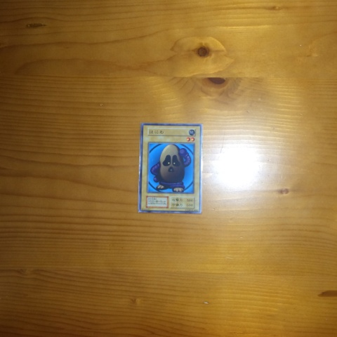

使用モンスターカード
===

**光属性**  

  

| | | |
|-|-|-|
|01|光8|青眼の白龍
|02|光1|薄幸の美少女
|03|光2|命の砂時計
|04|光3|北風と太陽
|05|光4|ホーリー・エルフ
|06|光5|ヴァルキリー
___

**闇属性**

  

| | | |
|-|-|-|
|07|闇7|ブラック・マジシャン
|08|闇1|クリボー
|09|闇2|運命のろうそく
|10|闇3|ガーゴイル
|11|闇4|ランプの魔精・ラ・ジーン
|12|闇5|カース・オブ・ドラゴン
___

**炎属性**

  

| | | |
|-|-|-|
|13|炎6|フレイム・ケルベロス
|14|炎2|スティング
|15|炎2|邪炎の翼
|16|炎2|ファイヤー・アイ
|17|炎3|炎を操る者
|18|炎3|壺魔人
|19|炎4|炎の魔神
|20|炎4|ギガテック・ウルフ
|21|炎5|ガルーザス
___

**水属性**  

  

| | | |
|-|-|-|
|22|水6|海の竜王
|23|水2|ヒトデンチャク
|24|水2|サイコ・カッパー
|25|水3|ルート・ウォーター
|26|水3|ドローバ
|27|水3|ウォーター・エレメント
|28|水4|海月-ジェリーフィッシュ-
|29|水4|ヤドカリュー
|30|水5|海竜神
___

**風属性**

  

| | | |
|-|-|-|
|31|風6|天空竜
|32|風2|ハリケル
|33|風2|ブレードフライ
|34|風3|ベビードラゴン
|35|風3|風の番人 ジン
|36|風4|砦を守る翼竜
|37|風4|タイホーン
|38|風4|ハーピィ・レディ
|39|風5|ウイング・イーグル
___

**地属性**

  

| | | |
|-|-|-|
|40|地2|はにわ