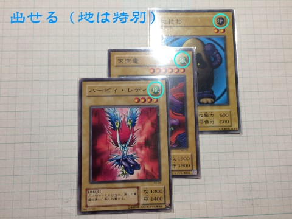

出せる・出せない
---

揃えて出すことが できるカードは、  
"同じ星の数" か "同じ色(右上)" です。  
  
**図1**  
  
___

以下は 出せない 例です。  

**図2**  
  
※ 右図に関して...  
"[光5] ヴァルキリー" か "[水4] 海月-ｼﾞｪﾘｰﾌｨｯｼｭ-"  
どちらかを 諦める必要が あります  
___
地属性 について
---  
  
地属性 は 特別です。  
「どんな色の 代わりにも なる」  
です。  
  
「どんな星数の 代わり・・・には ならない」  
ので 注意。