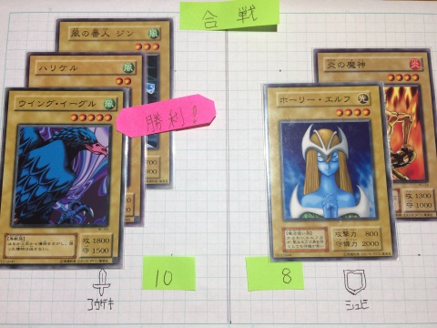
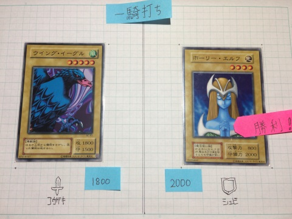

戦闘について
===

+ 攻め側 - 戦闘前に戦闘方法を二択する  
  - [合戦] : 星の数の合計で勝負 (基本同様)
  - [一騎] : 1体ずつ勝負。攻守を競う (元祖遊戯王寄り)

合戦  
---
  
  
上図は 左の勝利 です  
  
勝ったら、敵のカードを **1枚選んで** 得点とします。  
最終的に 取ったカードの枚数が多いプレイヤー の勝利です  

---
一騎打ち
---

  
上図は 右の勝利 です  

  
攻撃側 は カードの "攻撃力" を  
守備側 は カードの "守備力" を  
それぞれ比較し 大きいほうの 勝利 です。  

勝ったプレイヤー は **戦闘したカード** を得られ 得点となります。  
(このルールでは 守備側 であろうが、相手より強ければ 倒せます)  

同じ場合は？ : どちらも生き残り 互いに得点はありません