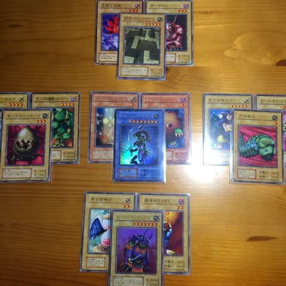
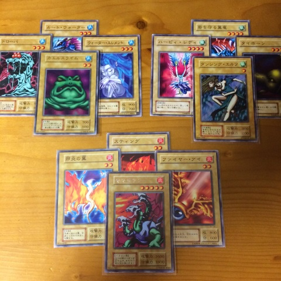

役について
===
<p align="center">
  "光" と "闇" 混ざりしとき<br>
  そこに "混沌~chaos~" 生まれけり
</p>

<p align="center">
  
</p>

---

<p align="center">
  自然の力、三の原子 重なりしとき<br>
  更なる力 目覚めけり
</p>

<p align="center">
  
</p>

___

その他、役
---
役一覧
---
```
モンスターカード 
11 222 33  44  55    78 : 光闇地
   222 33  44  5  6     : 炎
   22  333 44  5  6     : 　水
   22  33  444 5  6     : 　　風
==================================
2  10  9   9   5  3  2  : 計40枚
```

1. 五色五星 (ストレートフラッシュ的)
  - 星5 : 25
  - 星4 : 20
  - 星3 : 15
  - 星2 : 10
    - 実は "星5 x 5枚" こそ このゲーム最強 です

2. 一面一色 (フラッシュ的)
  - 光 : 22-15
  - 闇 : 21-15
  - 炎 : 22-12
  - 水 : 22-13
  - 風 : 23-14
