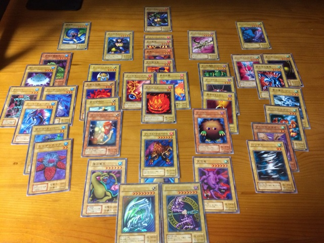
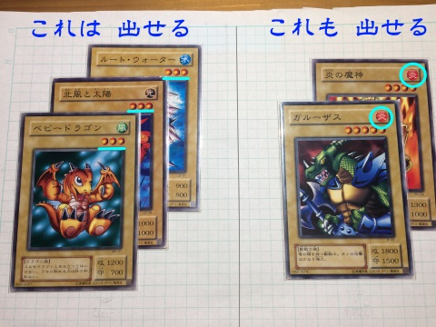

<h3 align="center" >
  遊戯王<br>
  オリジナルルール
</h3>
<h5 align="center">
  (ﾌｧｲﾌﾞｽﾀ-・ﾃﾞｭｴﾙ)
</h5>
<h1 align="center">
 ~~ 五星★決闘 ~~
</h1>
<!-- === -->
<p align="center">
  
</p>

```
使用モンスターカード 
11 222 33  44  55    78 : 光闇地
   222 33  44  5  6     : 炎　　
   22  333 44  5  6     : 　水　
   22  33  444 5  6     : 　　風
==================================
2  10  9   9   5  3  2  : 計40枚
```
[[詳細](!0_使用モンスターカード.md)]
___

基本ルール
---

<p align="center">
  「"色" か "星" を 揃えて勝て！！」
</p>

一つの山札 (計40枚) で 2人とも 遊びます。   
お互い カードを 5枚になるよう 引きます。  
カードを揃えて "せーの" で 場に出します。  
揃えて出すことが できるカードは、  
"同じ星の数" か "同じ色(右上)" です。 [[詳細](!1_出せる・出せない_詳細.md)]
<p align="center">
  
</p>
  
お互い 場に出せた星の合計を 数えます。  
その合計値で 競います。  
勝ったら 1点ゲット！  
(画像だと、「星9 vs 星9」 で あいこ です)  
  
先に 4点ゲットした人 が 勝ちです  
  
※ 何点獲得したか 覚えておく代わりに  
勝ったとき 相手の出したカードから 1枚取っておくと良いです  
  
---
エキスパートルール
---
基本的なルールに慣れたら 次のような要素を 加えるのも ｱﾘです

+ 攻守交替製

+ 攻め側 - 戦闘前に戦闘方法を二択する [[詳細](!2_戦闘について.md)]
  - [合戦] : 星の数の合計で勝負 (基本同様)
  - [一騎] : 1体ずつ勝負。攻守を競う (元祖遊戯王寄り)

**全体の流れ** 

| | | | 
|-|-|-
|ターン1 | 開始    | ----------------
|        | A君開始 | 手札が 5枚になるよう 引く
|        | A君守備 | 受けるカード 出す (裏向けで)
|        | B君開始 | 手札が 5枚になるよう 引く
|        | B君攻撃 | 攻めるカード 出す (表向けで)
|        | 戦闘[[詳細](!2_戦闘について.md)]| B君、[合戦] [一騎] 選択。いざ勝負！
|        | 終了    | 戦闘後、残ったカードは 墓地へ流す
|ターン2 | 開始    | ----------------
|        | B君開始 | 手札が 5枚になるよう 引く
|        | B君守備 | 受けカード 出す (裏向けで)
|        | A君開始 | (以下同様...)


+ 同時に出す組み合わせによる役 [[詳細](!3_役について.md)]
  - 同星の炎3枚、同星の光闇2枚
    ・・・といった一定の組み合わせで、追加でカードが出現！
    


---
参考リンク
---

[とっておき！　遊戯王の最高に面白い遊び方“ワンデッキデュエル”！](http://cardkingdom.jp/yuugi/ex01.html)(ｶｰﾄﾞｷﾝｸﾞﾀﾞﾑ)

---
以上です。  
デュエル スタンバイ！